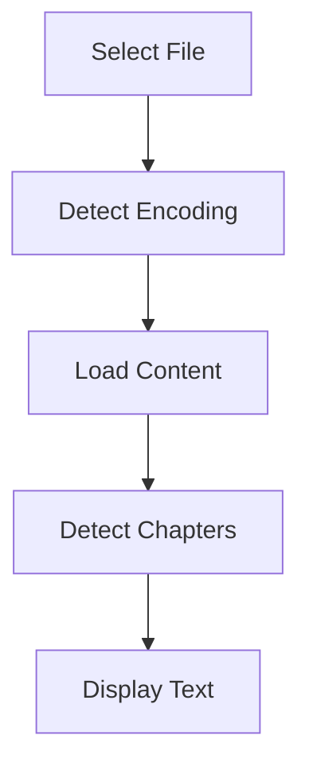
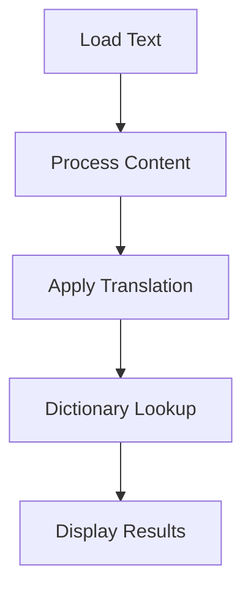
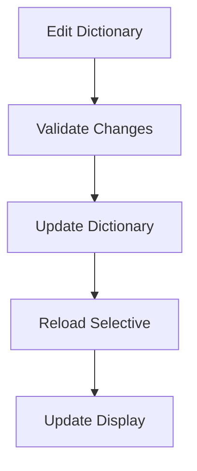

# Product Context

## Purpose

ZXReader is a specialized tool for reading and translating Chinese text into Sino-Vietnamese, designed to enhance the reading experience for Vietnamese readers studying Chinese texts.

### Core Problems Solved
1. **Language Barrier**
   - Enables Vietnamese readers to understand Chinese texts
   - Provides accurate Sino-Vietnamese translations
   - Maintains cultural and linguistic nuances

2. **Reading Experience**
   - Side-by-side original and translated text
   - Chapter-based navigation
   - Customizable display options
   - Efficient dictionary lookup

3. **Text Processing**
   - Handles multiple Chinese encodings
   - Processes large text files
   - Maintains text formatting
   - Preserves reading position

## User Experience Goals

### 1. Ease of Use
- Intuitive interface
- Clear navigation
- Responsive controls
- Consistent behavior

### 2. Performance
- Fast file loading
- Quick translations
- Smooth scrolling
- Efficient dictionary lookups
- Minimal resource usage

### 3. Reliability
- Accurate translations
- Stable operation
- Data preservation
- Error recovery

### 4. Customization
- Display preferences
- Font options
- Dictionary management
- Layout control

## Key Features

### 1. File Management
- Multiple encoding support
- Smart encoding detection
- Large file handling
- Position tracking

### 2. Translation
- Chinese to Sino-Vietnamese
- Character/word mapping
- Context awareness
- Dictionary integration

### 3. Navigation
- Chapter detection
- Position markers
- Quick navigation
- Progress tracking

### 4. Dictionary
- Custom dictionary editing
- Real-time updates
- Smart word lookup
- Case-sensitive handling
- Compound word support

### 5. Interface
- Split-panel display
- Resizable sections
- Font customization
- Theme options

## User Workflows

### 1. Opening Files

### 2. Translation Process

### 3. Dictionary Management

## Feature Details

### 1. File Support
- Text files (.txt)
- Multiple encodings
- Large file handling
- Progress indication

### 2. Translation Features
- Word-by-word translation
- Context awareness
- Dictionary integration
- Format preservation

### 3. Navigation Features
- Chapter detection
- Position tracking
- Quick jumping
- History tracking

### 4. Dictionary Features
- Custom entries
- Quick editing
- Real-time updates
- Compound words
- Case sensitivity

### 5. Display Features
- Split panels
- Font selection
- Theme options
- Layout control

## User Benefits

### 1. Efficiency
- Quick file loading
- Fast translations
- Efficient navigation
- Responsive interface

### 2. Accuracy
- Precise translations
- Context awareness
- Dictionary support
- Format preservation

### 3. Convenience
- Easy navigation
- Quick lookup
- Custom dictionaries
- Position saving

### 4. Learning
- Original text access
- Translation comparison
- Dictionary building
- Language patterns

## Success Criteria

### 1. Performance
- Sub-second file loading
- Instant translations
- Smooth scrolling
- Quick dictionary updates

### 2. Reliability
- Accurate translations
- Stable operation
- Data preservation
- Error handling

### 3. Usability
- Intuitive controls
- Clear feedback
- Consistent behavior
- Easy customization

### 4. Value
- Enhanced reading
- Learning support
- Time savings
- Knowledge retention
