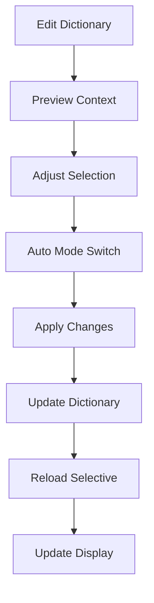

# Product Context

[Previous content up to Dictionary Features section remains unchanged...]

### 4. Dictionary Features
- Custom entries
- Quick editing with context preview
- Real-time updates
- Compound words
- Case sensitivity
- Intelligent case formatting
- Context-aware editing
- Interactive text selection
- Cross-dictionary lookup
- Smart mode switching

### 5. Display Features
[Remaining content remains unchanged...]

### 3. Dictionary Management

[Rest of the file remains unchanged...]
