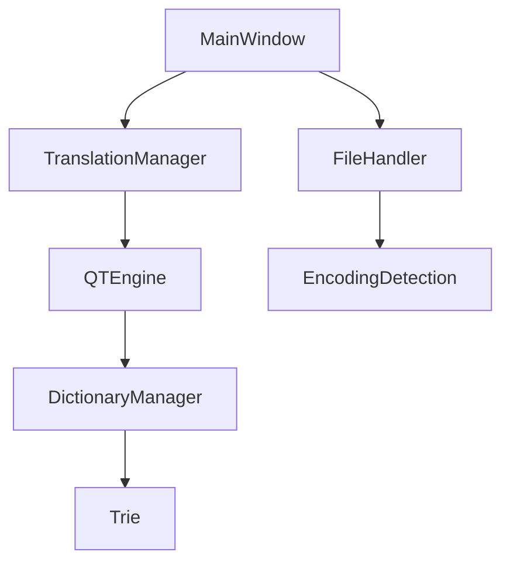
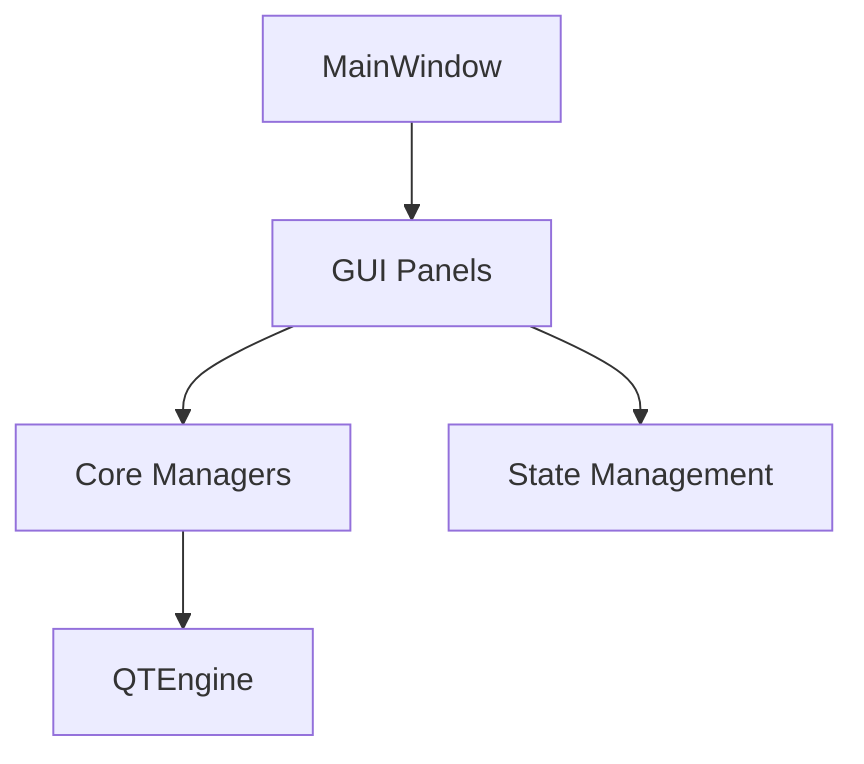
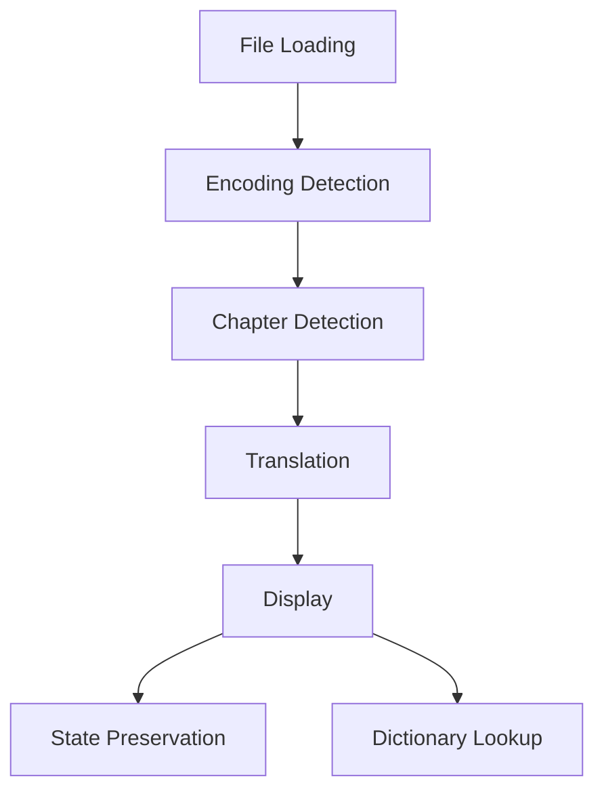

# ZXReader System Patterns

## System Architecture

### Core Components
1. **File Management**
   ```mermaid
   flowchart TD
       FileHandler[FileHandler] --> EncodingDetection[Encoding Detection]
       EncodingDetection --> Chardet[Chardet Detection]
       EncodingDetection --> ChineseEncodings[Chinese Encodings]
       EncodingDetection --> ValidationCheck[Chinese Validation]
       FileHandler --> FileInfo[File Info]
       FileHandler --> ContentLoading[Content Loading]
       FileHandler --> EncodingCache[Encoding Cache]
   ```

2. **Chapter Management**
   ```mermaid
   flowchart TD
       ChapterManager[ChapterManager] --> DetectionMethods[Detection Methods]
       ChapterManager --> ChapterList[Chapter List]
       ChapterManager --> TitleTranslation[Title Translation]
       ChapterManager --> StateTracking[State Tracking]
   ```

3. **Translation System**
   ```mermaid
   flowchart TD
       TranslationManager[TranslationManager] --> QTEngine[QTEngine]
       QTEngine --> TextProcessing[Text Processing]
       QTEngine --> TranslationMapping[Translation Mapping]
       TranslationManager --> StateManagement[State Management]
   ```

4. **Dictionary System**
   ```mermaid
   flowchart TD
       DictionaryManager[DictionaryManager] --> QTDictionaries[QT Dictionaries]
       DictionaryManager --> ExternalDictionaries[External Dictionaries]
       DictionaryManager --> CustomDictionaries[Custom Dictionaries]
   ```

### GUI Components
1. **Main Window**
   ```mermaid
   flowchart TD
       MainWindow[MainWindow] --> FileInfoPanel[File Info Panel]
       MainWindow --> ChapterPanel[Chapter Panel]
       MainWindow --> TranslationPanel[Translation Panel]
       MainWindow --> DictionaryPanel[Dictionary Panel]
   ```

2. **Panel Relationships**
   ```mermaid
   flowchart TD
       TranslationPanel[Translation Panel] --> DictionaryPanel[Dictionary Panel]
       ChapterPanel[Chapter Panel] --> TranslationPanel
       FileInfoPanel[File Info Panel] --> ChapterPanel
       TranslationPanel --> StatePreservation[State Preservation]
   ```

## Key Technical Decisions

### 1. MVC Pattern Implementation
- **Model:** Core managers (File, Chapter, Translation, Dictionary)
- **View:** GUI panels and components
- **Controller:** Main window and panel controllers

### 2. Data Structures
- **Trie for Dictionary**
  - Efficient prefix-based lookups
  - Supports longest prefix matching
  - Used in both QTEngine and dictionary lookup

- **Translation Mapping**
  - Bidirectional mapping between original and translated text
  - Position tracking for accurate highlighting
  - Block-based segmentation for efficient lookup

### 3. File Operations
- **Enhanced Encoding Detection**
  - Multi-layer detection approach:
    1. Try last successful encoding (cached)
    2. Use chardet with confidence threshold
    3. Try common Chinese encodings
    4. Validate Chinese character presence
  - Special handling for GB2312/GB18030
  - Encoding caching for performance
  - Robust fallback mechanisms

- **Content Processing**
  - Chunked reading for large files
  - Efficient chapter detection
  - Memory-conscious text handling
  - Smart encoding validation

### 4. State Management
- **Chapter Position**
  - Track current chapter index
  - Preserve position during text toggle
  - Reset only on new file load

- **Text Display**
  - Toggle state tracking
  - Position preservation
  - Consistent state across panels

### 5. Event System
- **Signal-Slot Connections**
  - Chapter selection events
  - Dictionary lookup triggers
  - Panel update notifications
  - Theme change events
  - Encoding detection events

### 6. Resource Management
- **Font Loading**
  - Dynamic font registration
  - Font fallback system
  - Variable font support

- **Dictionary Loading**
  - Lazy loading of dictionaries
  - Cache management
  - Custom dictionary synchronization

## Design Patterns

### 1. Singleton Pattern
- Used for managers (Dictionary, Translation)
- Ensures consistent state across application

### 2. Observer Pattern
- Panel updates and notifications
- Dictionary lookup events
- Chapter selection changes
- Encoding detection events

### 3. Factory Pattern
- Chapter detection methods
- Dictionary source creation
- Panel component creation
- Encoding detector creation

### 4. Strategy Pattern
- Text processing algorithms
- Chapter detection methods
- Dictionary lookup strategies
- Encoding detection strategies

### 5. Cache Pattern
- Encoding detection results
- Last successful encoding
- Dictionary lookups
- Translation results

## Component Relationships

### 1. Core Dependencies


### 2. Panel Dependencies


### 3. Data Flow


## Error Handling Strategy
1. **Hierarchical Error Propagation**
   - Core errors bubble up to managers
   - Managers handle or propagate to UI
   - User-friendly error messages
   - Encoding-specific error handling

2. **Recovery Mechanisms**
   - Fallback encoding options
   - State restoration after errors
   - Graceful degradation of features
   - Smart encoding retry logic

3. **Logging System**
   - Error tracking and reporting
   - Debug information collection
   - Performance monitoring
   - Encoding detection logging
